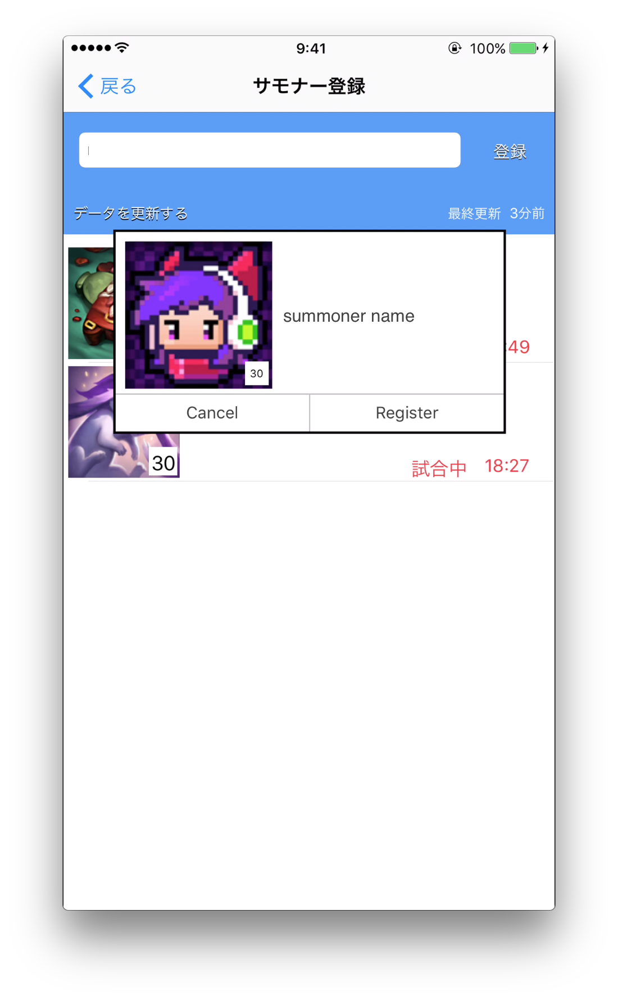
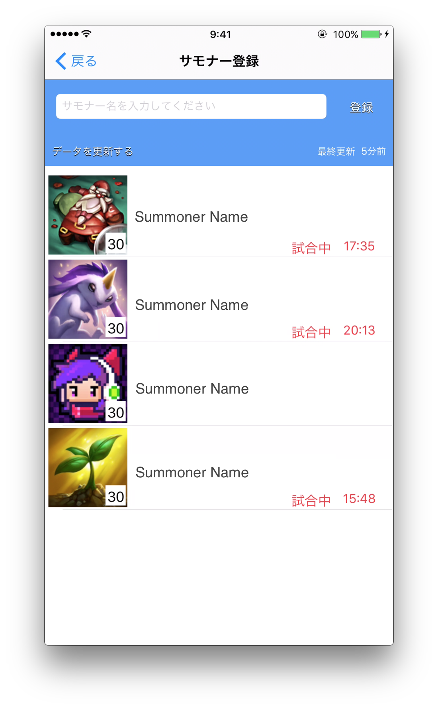
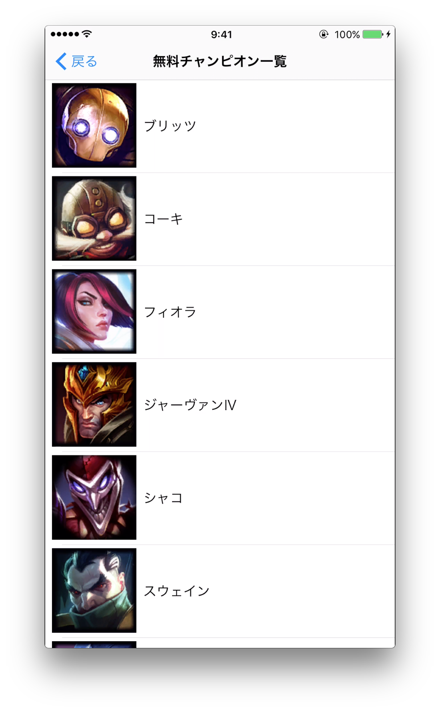
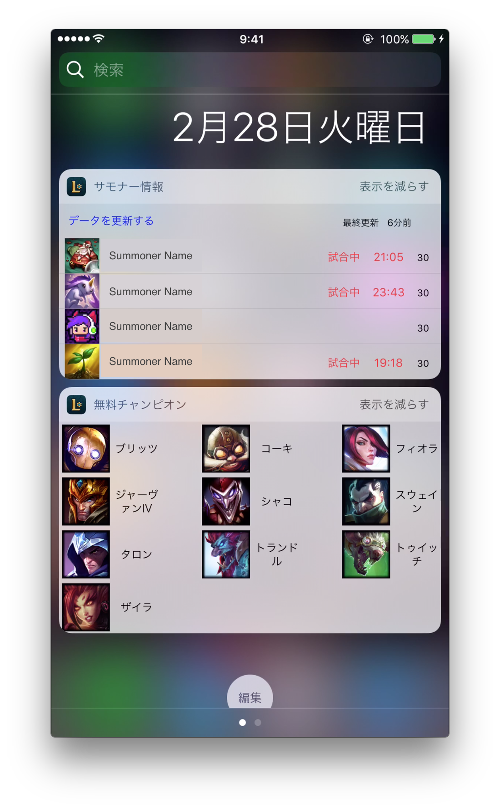

# LOLWidgets
LOLWidgets説明ページ 

## 概要
　LOLWidgetsはLeague of Legends(LOL)のゲーム情報をiOS端末の通知センターに表示することにより、ユーザーが迅速に情報を得ることをサポートするiOSアプリケーションです。 
　初回リリース時の機能は「サモナー情報」「無料チャンピオン一覧」の2つです。 
　対応している地域はJPとNAで、設定画面から変更することが可能です。ただし、言語は日本語のみです。 

## 機能紹介
　LOLWidgetsに含まれる機能を紹介します。 
 
画面用語 
・本体アプリ 
　iOSアプリケーションの本体の機能を指します。後述のウィジェットと区別するために使います。 
・ウィジェット 
　iOSの通知センターに表示するウィジェットアプリを指します。 
・WebView 
　本体アプリ上でWebサイトを表示している部分を指します。 

### サモナー情報

 
　本体アプリ上で、サモナー名からサモナーを検索して登録することができます。(上限4人) 
　登録したサモナーは本体アプリとウィジェットに一覧として表示され、試合中の人には現在試合が何分経過したかが表示されます。 
　更新ボタンを押すことで最新の情報を表示することができますが、更新は一定の間隔を置かなければ行うことができません。 
　また、サモナーをタップすることでサモナーの情報サイトをWebViewで表示します。 

### 無料チャンピオン一覧
 
　本体アプリとウィジェットに、現在遊べる無料チャンピオンの一覧を表示します。 
　チャンピオンをタップすることでチャンピオンの情報サイトをWebViewで表示します。 

### ウィジェット
 
通知センターに専用のウィジェットが配置され、それぞれの情報を素早く閲覧することができます。 
サモナー名やチャンピオン名をタップすることで本体アプリが起動し、情報サイトをWebViewで表示します。 
