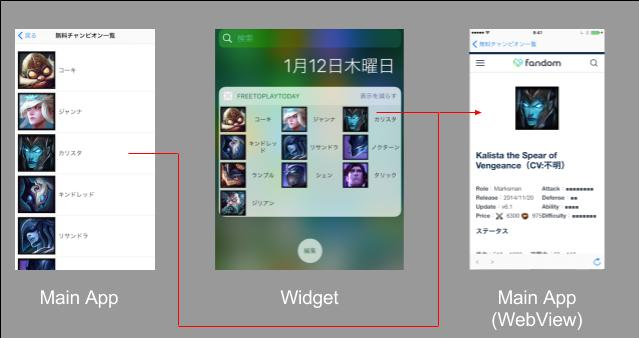

# LOLWidgets
## 概要
LOLWidgetsはLeague of Legends(LOL)のゲーム情報をウィジェットに表示することにより、
ユーザーが迅速に情報を得ることをサポートするiOSアプリケーションです。 
初回リリース時の機能は「無料チャンピオン一覧」「サモナー一覧」の2つです。 
対応している地域はJPとNAで、設定画面から変更することが可能です。 
ただし、言語は日本語のみです。 

## 無料チャンピオン一覧 機能紹介
 
アプリ内と、iOSのTodayの領域に、現在遊べる無料チャンピオンの一覧を表示します。
チャンピオンをタップすることでチャンピオンの詳細サイトをアプリ内のWebViewで表示することができます。

## 機能2
## 機能3

## イメージ画像

