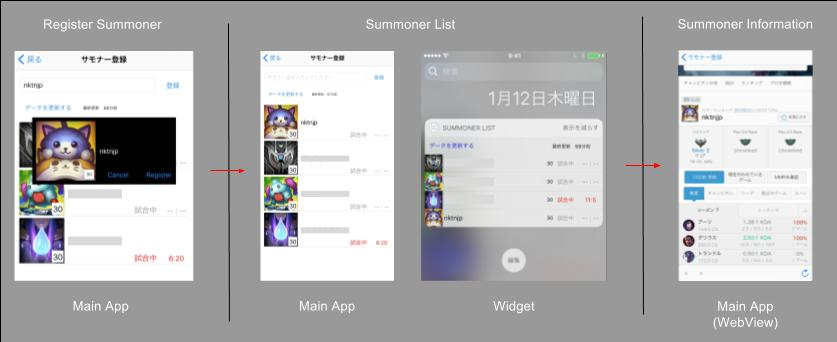

# LOLWidgets
LOLWidgets説明ページ 

## 概要
　LOLWidgetsはLeague of Legends(LOL)のゲーム情報をiOS端末の今日(Today Widget)に表示することにより、ユーザーが迅速に情報を得ることをサポートするiOSアプリケーションです。 
　初回リリース時の機能は「無料チャンピオン一覧」「サモナー一覧」の2つです。 
　対応している地域はJPとNAで、設定画面から変更することが可能です。ただし、言語は日本語のみです。 

## 機能紹介
　LOLWidgetsに含まれる機能を紹介します。 
 
画面用語 
・ Main App 
　iOSアプリケーションの本体の機能を指します。後述のWidgetと区別するために使います。 
・ Widget 
　iOSのToday領域に表示するWidgetを指します。 
・ WebView 
　Main App上でWebサイトを表示している部分を指します。 

### 無料チャンピオン一覧
 
　Main AppとWidgetに、現在遊べる無料チャンピオンの一覧を表示します。 
　チャンピオンをタップすることでチャンピオンの詳細サイトをMain AppのWebViewで表示することができます。

### サモナー一覧
画像内のnktnjp以外のサモナー名は伏せています 
 
　Main Appでサモナー名からサモナーを検索して登録することができます。(上限4人) 
　登録したサモナーはMain AppとWidgetに一覧として表示され、試合中の人には現在試合が何分経過したかが表示されます。 
　更新ボタンを押すことで最新の情報を表示することができますが、更新は一定の間隔を置かなければ行うことができません。 
　また、サモナーをタップすることでサモナーの詳細サイトをMain AppのWebViewで表示することができます。
